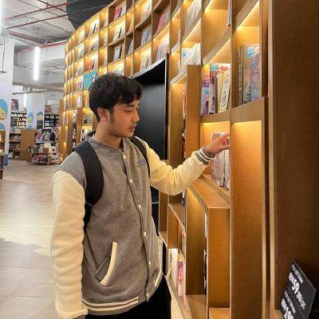

# 👋 Hello, I'm Wan Muhammad Hakimi!

Welcome to my GitHub profile! I’m currently a student in the **Software Maintenance and Evolution** course, excited to learn about modern software maintenance techniques and how to tackle legacy systems.

---

## 🎯 Course Goals
- Deepen my understanding of software maintenance practices.
- Get hands-on experience with real-world projects involving legacy systems.

---

### 🎵 Fun Fact  
Outside of coding, I love spending my free time listening to **music** 🎶 and playing **video games** 🎮.

---

## 🌐 GitHub Profile  
Feel free to check out my projects and contributions:  
[Visit my GitHub Profile](https://github.com/WannHakimi)

---

Thanks for stopping by! 😊

